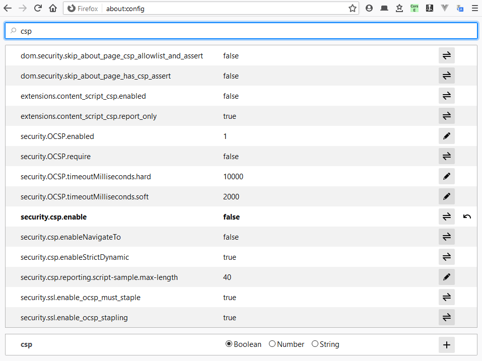

# [WIP] JSquadBot

Automation-based chatbot that is able to read and answer messages from a browser-based chat such as Web WhatsApp.

It's not integrated directly with the chat API. Instead, it emulates the user in the browser and lets the webpage handle the requests. It was made like that not because it was the best approach, but for learning purposes.

Only WhatsApp is supported out of the box but, since it was developed in MVVM, it should be easy to make it work anywhere else. Basically, you only need to implement [these methods](./CONTRIBUTING.md#methods-to-implement), which handle the DOM.

Another advantage from the MVVM approach is that you can use only the functionality that matters to you. For instance, you can take only the View layer and use it for a purpose other than a chatbot.

## Usage

1. Install an extension to skip CORS in your browser, like _CORS Everywhere_.

1. Disable CSP. In Firefox, go to `about:config` and disable the option `security.csp.enable`.

	

1. Open a new tab in your browser and access the `clever bot` website. That's so your browser can load the required cookies.

1. Inject all the code from [jsquadbot.min.mjs](./jsquadbot.min.mjs) into the webpage. There are several ways to do that. The most straightforward one is to just copy and paste it into the browser console. Another way is to use a browser extension that allows JS code to be injected automatically.

The injected code does nothing until it's actually called. See the examples below.

### Example

```javascript
let chat = new ChatController(new ChatViewWhatsApp('Eliza'));
// "Eliza" is the name of the contact or group you want to attach the bot to.

await chat.addBot('HAL');
// add a bot named "HAL" to the conversation with "Eliza".

await chat.update();
// bot will read and answer messages that contain its name.
```

### Using the lib for other purposes

```javascript
let view = new ChatViewWhatsApp('Bob');
await view.postMessage('Hello!'); // sends message to Bob
```
